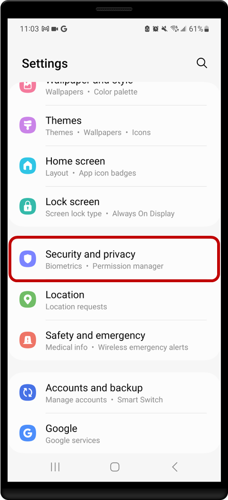
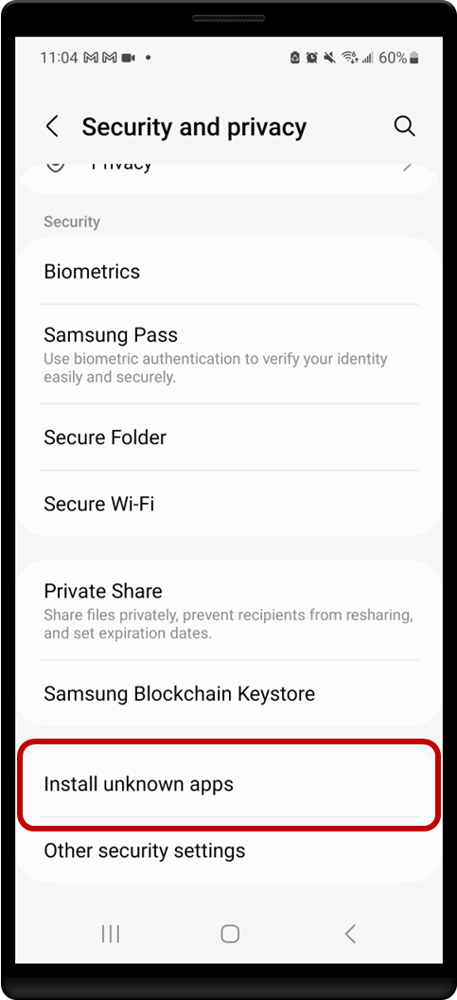
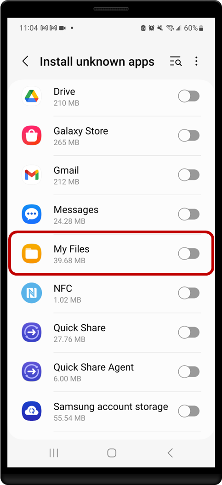
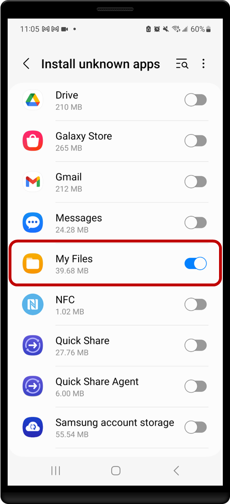
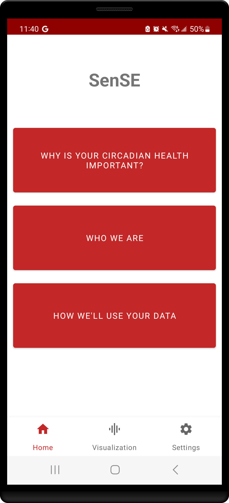
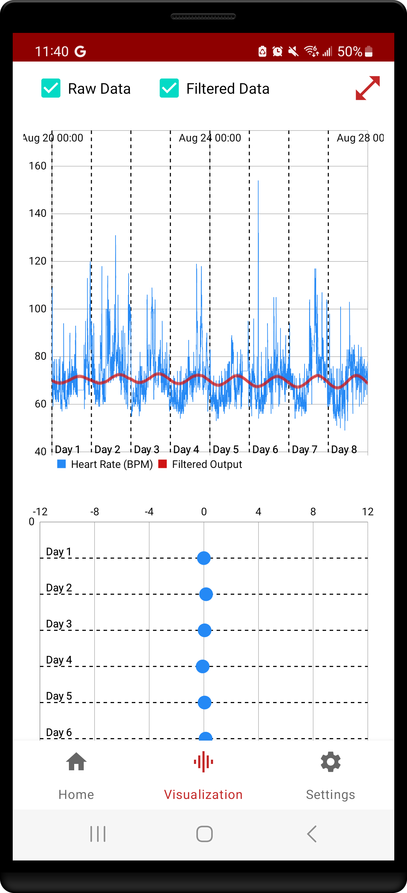
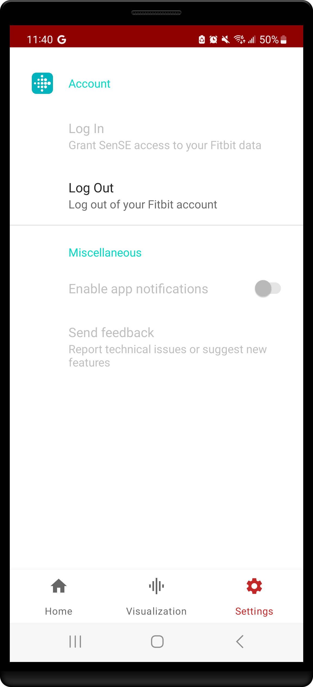

# SenSE App
SenSE is an Android application developed by the [Julius Lab](https://julius-lab-rpi.github.io/) in the Department of Electrical, Computer, and Systems Engineering at the [Rensselaer Polytechnic Institute](https://rpi.edu/). 

The app implements an algorithm developed by the Lab to estimate users' circadian phase shifts using biometric data. In its current state, the filter processes heart rate data and extracts the underlying circadian signal, which can be used in subsequent control attempts.

The circadian system is incredibly complex and comprises numerous internal subsystems that all work in concert to keep a person in sync with their environment. Some well-known biological processes with circadian components include the sleep-wake cycle, alertness, metabolism, and cardiovascular function. With so many processes making up and affected by the circadian system, it's in our best interest that we minimize disruptions to it. Unfortunately, our daily activities don't always line up with our body's natural cycles, so we are often left having to manually balance the two. This balancing act is also done without the most important information - the circadian state.

To balance better, we need to be able to measure the circadian state and identify when disruptions happen. This is where SenSE comes in. By providing a means to continuously assess the circadian state, we can help users more intelligently plan around their body clocks and potentially combat the effects of chronic circadian misalignment. The long-term goals of the application are to create a pipeline for crowd-sourcing useful data for our research and to test the underlying circadian algorithms we develop in diverse situations. 


## Project Status


This project is currently under active development. We welcome fellow researchers to try out the application and fill out the in-app feedback form.

Contributions are also welcome on this app, and we are always open to collaborating on research, so feel free to reach out to [Chukwuemeka Osaretin Ike](https://www.linkedin.com/in/chukwuemeka-ike).

As the project matures, the app contribution process will evolve to mirror standard open source practices.


## Install
To install the app, there are currently two options based on your level of comfort.

### APK Install
For the easiest install, there is a pre-built Android package (apk) for the most up-to-date version of the app located in the [apk folder](https://github.com/Chukwuemeka-Ike/SenSEApp/tree/dev/apk). To install the app, download the *app-debug.apk* file to your mobile device, and follow the process below for installing an apk.
1. Navigate to Settings
2. Search for "Install Unknown Apps"
3. Enable the setting. Note: For security purposes, this setting is disabled by default to prevent installation of malicious applications.
4. Navigate to the downloaded apk
5. Install the application

The process varies slightly by phone manufacturer. An example of this workflow for a Samsung Galaxy S22 is shown in the screenshots below.
|||||
|:-:|:-:|:-:|:-:|

[This link](https://www.lifewire.com/install-apk-on-android-4177185) gives a more detailed apk installation process if needed.

### Android Studio Install
If you are familiar with Android Studio, you can instead clone this repository and use it to build and install the app onto your device. [This link](https://developer.android.com/studio/run) contains instructions for building and running an application using Android Studio. This method would be most useful for those interested in the development of the app.


## Usage
To use the application, the user has to log in to Fitbit. This allows the app access their heart rate data and perform its filtering. Once logged in, the app optimizes the filter and displays data once it's available.

The screenshots below show the app's three major screens.
||||
|:-:|:-:|:-:|


## Literature
This application was developed in support of the thesis work done by Chukwuemeka Osaretin Ike. The filtering algorithms it implements are detailed further in the following peer-reviewed articles, along with discussions of the rationale behind the approaches.
* [Fast tuning of observer-based circadian phase estimator using biometric data](https://scholar.google.com/citations?view_op=view_citation&hl=en&user=kgLMmEIAAAAJ&citation_for_view=kgLMmEIAAAAJ:d1gkVwhDpl0C)
* [Efficient Estimation of the Human Circadian Phase via Kalman Filtering](https://scholar.google.com/citations?view_op=view_citation&hl=en&user=kgLMmEIAAAAJ&citation_for_view=kgLMmEIAAAAJ:UeHWp8X0CEIC)

### Citation
If you find the work done in either article useful, please cite accordingly.
``` bibtex
@article{ike2022fast,
  title={Fast tuning of observer-based circadian phase estimator using biometric data},
  author={Ike, Chukwuemeka O and Wen, John T and Oishi, Meeko MK and Brown, Lee K and Julius, A Agung},
  journal={Heliyon},
  volume={8},
  number={12},
  year={2022},
  publisher={Elsevier}
}
```

```bibtex
@article{ikeefficient,
  title={Efficient Estimation of the Human Circadian Phase via Kalman Filtering},
  author={Ike, Chukwuemeka O and Wen, John T and Oishi, Meeko MK and Brown, Lee K and Julius, A Agung}
}
```


## Known Bugs
### OEM Killing App and Preventing Background Work (08/28/2023)
I use [WorkManager](https://developer.android.com/topic/libraries/architecture/workmanager) to schedule the daily filter updates and weekly  optimizations (every 7th update), but these updates do not run as expected on every device. This unwanted behavior is triggered when the app is closed from the *recents* screen. It's a known [issue](https://issuetracker.google.com/issues/110745313) that multiple OEMs trigger a force stop when apps are closed from *recents* instead of the Stock Android approach. 

At this time, I don't have a robust workaround. I simply have the Worker enqueue another update when it fails. That second run is triggered whenever the app is opened again by the user. This has the unwanted effect of forcing the user to wait for the optimization to finish before they can use the app. The desired behavior is that they only have to wait for the very first optimization and then every subsequent one is done at night when they're least likely to be using the app.